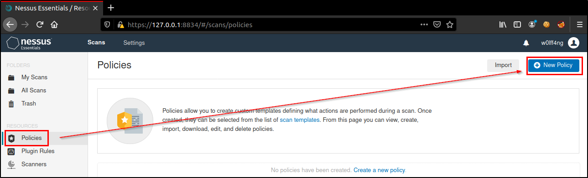
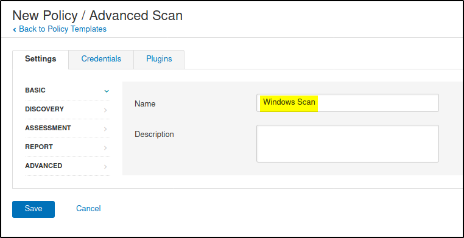
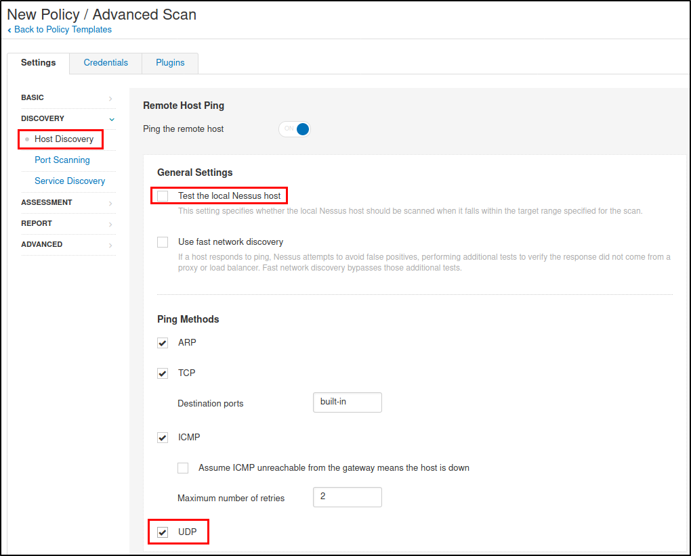
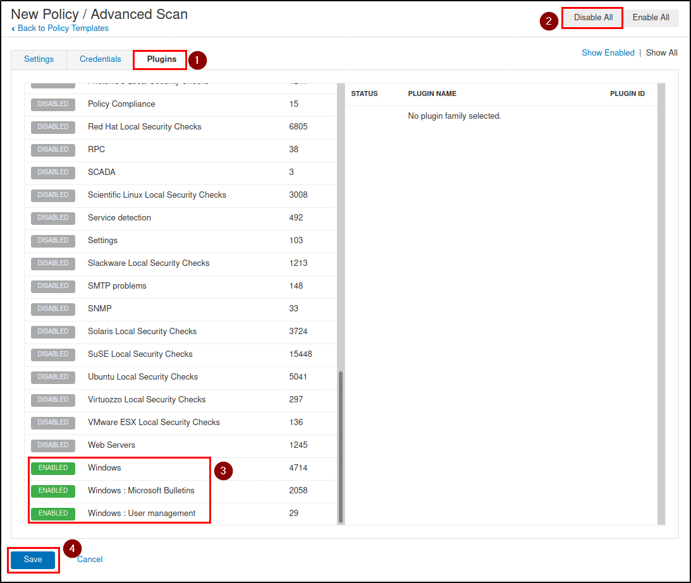
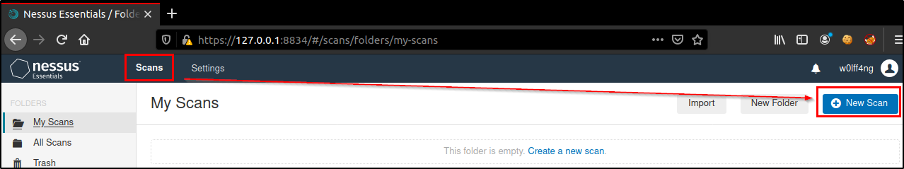
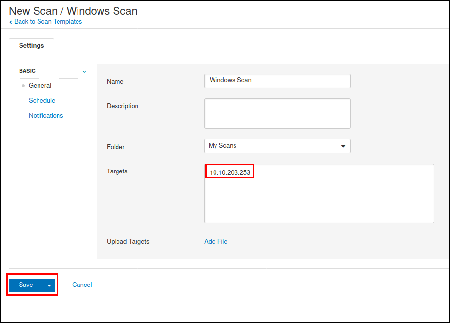
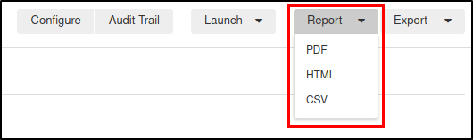

# Vulnerability Assessment Cheat Sheet

- [Ciclo de vida de un análisis de vulnerabilidades](#ciclo-avu)
  - [Nessus](#nessus)
    - [Comandos en Kali](#nessus-comandos)
    - [Iniciar/Detener Nessus](#nessus-2)
    - [Realiza una actualización, según lo indicado por GUI](#nessus-3)
    - [Fuerza a una actualización de todos los componentes de Nessus](#nessus-4)
    - [Fuerza a la actualización de solo los plugins](#nessus-5)
    - [Realiza un de los plugins a través de un archivo tar](#nessus-6)
    - [Ejemplo de escaneo de vulnerabilidades](#nessus-7)

<h2 id="ciclo-avu">Ciclo de vida de un análisis de vulnerabilidades</h2>

Una evaluación de vulnerabilidad es un análisis de las vulnerabilidades encontradas en redes y aplicaciones. En un AVU (análisis de vulnerabilidades) no se confirma mediante explotación una vulnerabilidad, además, corresponde a un proceso lineal:


Para llevar a cabo este análisis, por lo general, se utiliza un [escáner de vulnerabilidades](https://sectools.org/tag/vuln-scanners/), el cual, utiliza una base de datos con vulnerabilidades conocidas para detectarlas en el sistema. Estos escáneres realizan pruebas en:

- Daemons escuchando en puertos TCP y UDP
- Archivos de configuración de sistemas operativos, paquetes de software, dispositivos de red, etc.
- Entradas de registro de Windows

Vendors de escáneres de vulnerabilidades:

-	[OpenVAS](http://www.openvas.org/)
-	[Nexpose](https://www.rapid7.com/products/nexpose/)
-	[GFI LAN Guard](https://www.gfi.com/products-and-solutions/network-security-solutions/gfi-languard)
-	[Nessus](https://www.tenable.com/products/nessus)

Es necesario tener en cuenta que, para aplicaciones customizadas, puede que un escáner no sea efectivo, por lo tanto, es necesario hacer pruebas manuales. Para aplicaciones customizadas, seguir los siguientes pasos:

-	Aprender y entender sus características
-	Entender como intercambia datos con la red
-	Entender como ingresa a recursos como: bases de datos, servidores, archivos locales/remotos, etc.
-	Aplicar ingeniería inversa

<h3 id="nessus">Nessus</h3>

Para utilizar Nessus, se deben seguir los siguientes pasos:

1. Escaneo de puertos (realizados en la enumeración). Nessus realiza uno para validar que puertos están abiertos, y si la máquina está viva.
2. Detección de servicios. Luego de identificar los puertos abiertos, se realizan pruebas para identificar los servicios corriendo (nombre y versión).
3. Por cada servicio detectado, se realiza una query a la base de datos para determinar si tiene alguna vulnerabilidad conocida (se puede especificar que vulnerabilidades buscar).
4. Pruebas, en este paso, el escáner envía probes para verificar la existencia de la vulnerabilidad (pueden existir falsos positivos).

<h4 id="nessus-comandos"><a href="https://docs.tenable.com/nessus/Content/CommandLineOperations.htm">Comandos en Kali</a></h4>

`/etc/init.d/nessusd [option]`

`/opt/nessus/sbin/nessuscli [args]`

<h4 id="nessus-2">Iniciar/Detener Nessus</h4>

```
/etc/init.d/nessusd start
/etc/init.d/nessusd stop
```

<h4 id="nessus-3">Realiza una actualización, según lo indicado por GUI</h4>

`/opt/nessus/sbin/nessuscli update`

<h4 id="nessus-4">Fuerza a una actualización de todos los componentes de Nessus</h4>

`/opt/nessus/sbin/nessuscli update --all`

<h4 id="nessus-5">Fuerza a la actualización de solo los plugins</h4>

`/opt/nessus/sbin/nessuscli update –plugins-only`

<h4 id="nessus-6">Realiza un <a href="https://docs.tenable.com/nessus/Content/ManageNessusOffline.htm">update</a> de los plugins a través de un archivo <a href="https://docs.tenable.com/nessus/Content/DownloadAndCopyPlugins.htm">tar</a></h4>

`/opt/nessus/sbin/nessuscli update file.tar.gz`

<h4 id="nessus-7">Ejemplo de escaneo de vulnerabilidades</h4>

1. Ejecutar Nessus. Comando: `/etc/init.d/nessusd start`
2. Actualizar Nessus. Comando: `/opt/nessus/sbin/nessuscli –-all`
3. Abrir Nessus en el navegador: `https://127.0.0.1:8834`
4. Crear una política, con la cual se define un template que especifica que acciones tomar durante un escaneo:











5. Crear un nuevo scan:






6. Ejecutamos el scan:


7. Ingresamos a ver los resultados haciendo clic en el nombre del scan:


8. Revisar el reporte con las vulnerabilidades encontradas:



